# 问题反馈工单平台 · 图文使用指南

> 本指南分「通用 / 客户（电力交易员）/ 研发 / 管理员」四部分，**通用部分所有人都要看**，其余按自己的角色阅读。
> 文中配图位于 `docs/images/` 目录。

---

## 一、通用（所有人）

### 1. 登录

- 平台地址：`http://58.221.192.245:3333`，推荐 Chrome / Edge 浏览器。
- 账号已统一初始化：**登录名为姓名全拼**（如 张三 → `zhangsan`），初始密码 `Ly123456`。
- 新成员可点「注册」自助创建账号（默认客户角色），或联系管理员添加。

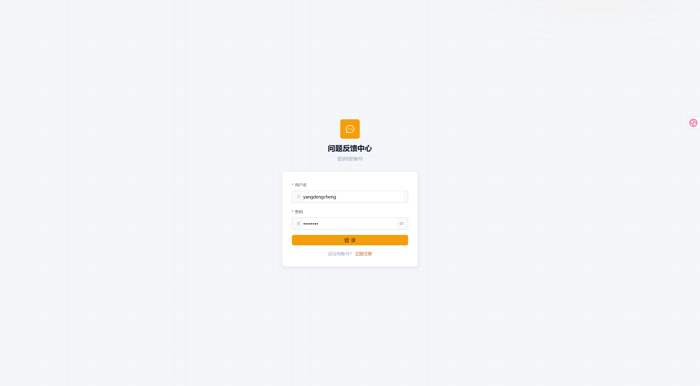

### 2. 认识界面

顶栏从左到右：**看板 / 工单 / 工具包 /（服务监控）/ 通知铃铛**；右侧是主题切换（明 / 暗，自动记住偏好）和头像菜单（退出登录）。

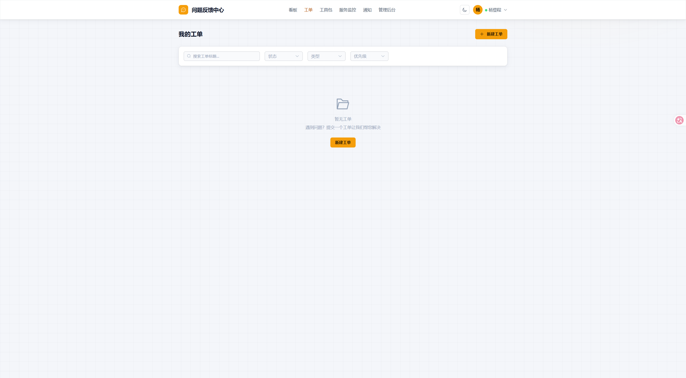

### 3. 通知别漏看

- **站内通知**：铃铛上显示未读数；点铃铛进通知中心，点单条通知跳转到对应工单，可「全部已读」。
- **桌面通知**：有新消息时屏幕右下角弹出，**常驻、需手动关闭**，点击可跳转工单。首次使用浏览器询问权限时请选「允许」。
- 若 HTTP 环境下桌面通知不弹出，按文末「附：桌面通知配置」操作一次即可。

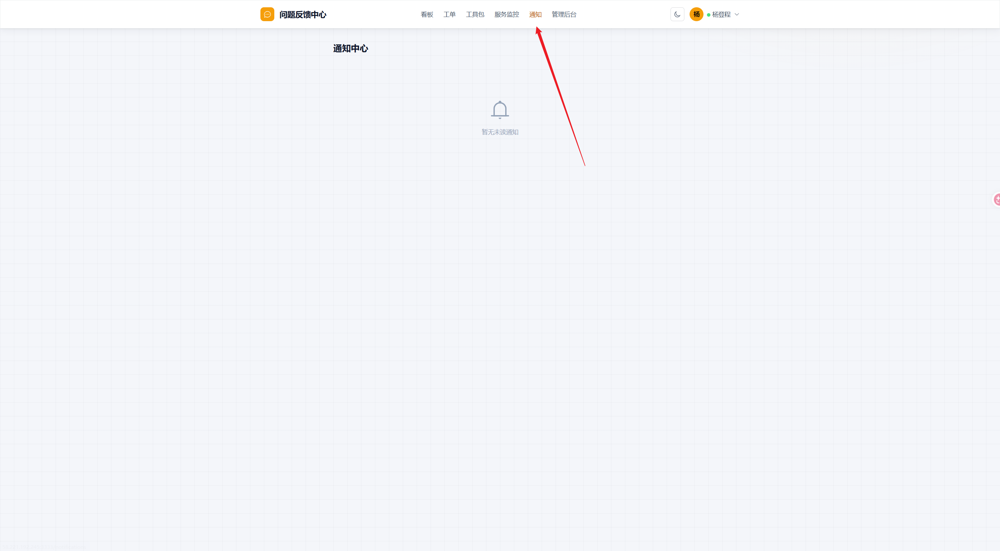

### 4. 你的角色能看到什么

> 系统中的「客户」角色即我们的**电力交易员**，下文两词混用。

| 角色                       | 工单可见范围            | 主要操作                                |
| -------------------------- | ----------------------- | --------------------------------------- |
| 客户（电力交易员）         | 仅自己创建的            | 提单、评论、确认解决 / 退回、下载工具包 |
| 数据维护 / 系统开发 / 测试 | 自己创建 + 分配给自己的 | 处理、转交、评论                        |
| 研发主管 / 管理员          | 全部                    | 处理、转交、后台管理                    |

---

## 二、客户使用（业务方）

### 1. 提交工单

1. 顶栏「工单」→「新建工单」。
2. 填**标题**（必填）、**类型**（Bug / 使用问题）、**优先级**（低 / 中 / 高）、**详细描述**，可上传截图 / 日志附件。
3. 提交后状态为「待处理」，研发主管与管理员会立刻收到通知。

> 填写建议：标题一句话说清问题；描述写清"在哪个页面、做了什么操作、期望什么结果、实际什么结果"；有报错截图务必上传。

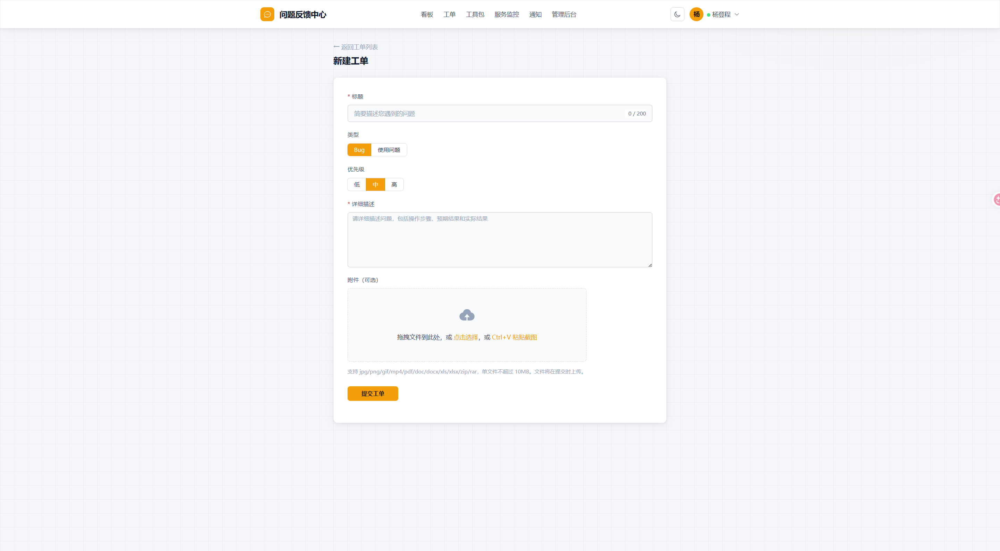

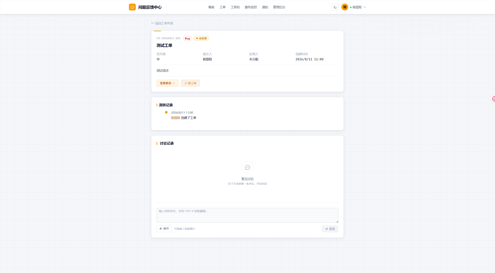

### 2. 查看我的工单

客户只看到**自己创建**的工单；可按状态 / 类型 / 优先级筛选，也可按关键词搜标题。

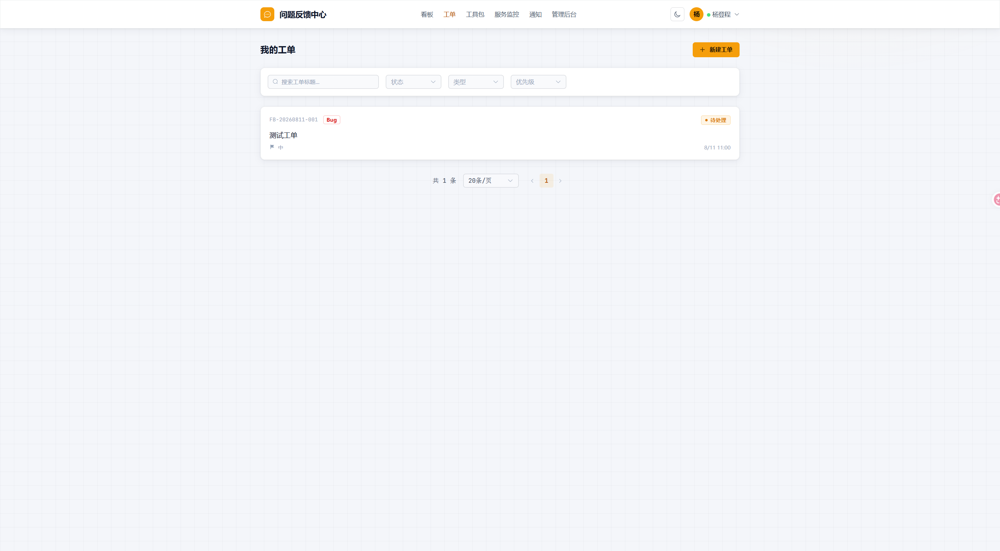

### 3. 看详情、跟进度

详情页包含：基本信息（编号 / 状态 / 处理人 / 时间）、描述与附件、**流转记录**（每一步操作留痕）、评论区。

### 4. 评论沟通

在评论区留言（可带附件），处理人会收到通知；处理人的回复你也会收到通知。

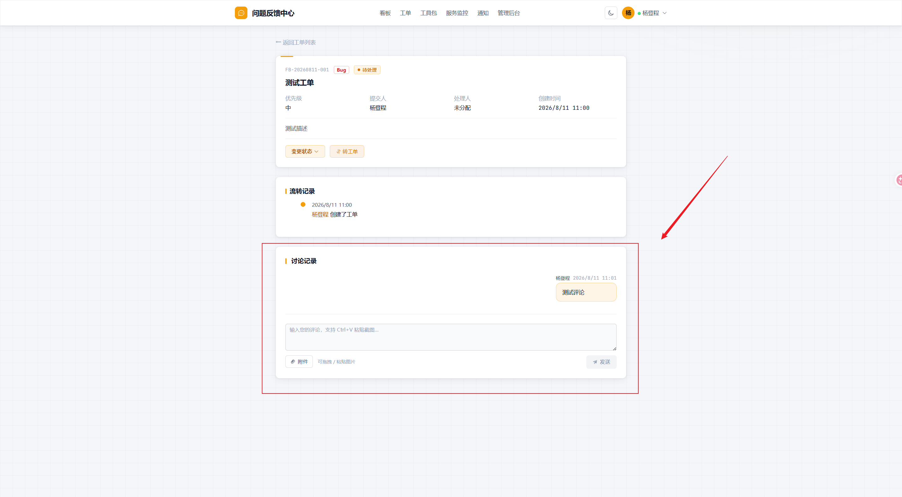

### 5. 确认解决 / 退回 / 重新打开

- 工单「已解决」后：问题确实解决 → 点「**确认解决**」关闭；问题还在 → 点「**未解决，继续讨论**」退回处理中。
- 工单「已关闭」后问题复发：点「**重新打开**」。

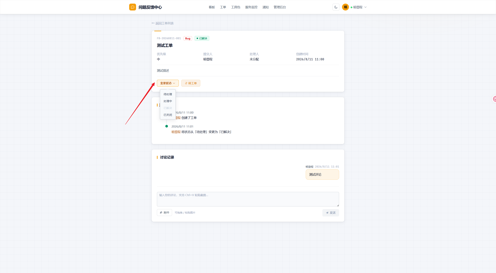

### 6. 下载工具包

「工具包」页按省份 / 分类浏览；进详情可查看说明文档与版本历史，点「下载最新版本」或指定版本下载，下载文件名为正常中文名。

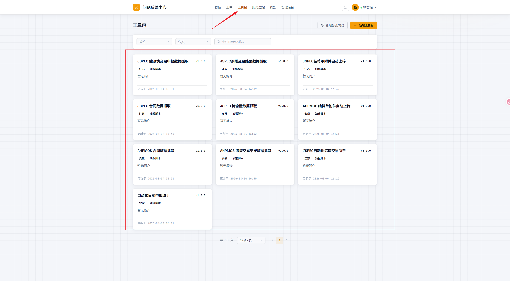

---

## 三、研发使用（内部角色）

### 1. 工单看板

四张状态卡片（待处理 / 处理中 / 已解决 / 已关闭）+ 最近工单，点卡片跳转对应列表。
统计口径与工单列表一致：管理员 / 研发主管 = 全部；其他内部角色 = 我创建的 + 分配给我的。

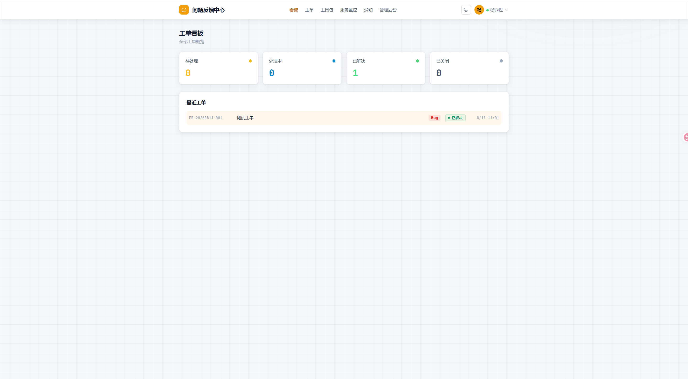

### 2. 处理工单

- 在工单详情用「**变更状态**」下拉切换：处理中 / 已解决 / 已关闭；已关闭的可「重新打开」。
- 改为「已解决」时客户会自动收到通知。

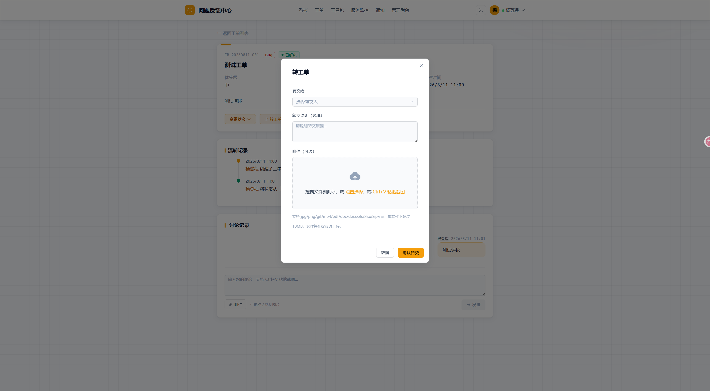

### 3. 转交工单

1. 详情点「转交」，选择目标处理人（仅内部人员）。
2. **转交说明必填**，会写入流转记录。
3. 转交后原「待处理」自动变「处理中」，新处理人收到通知。

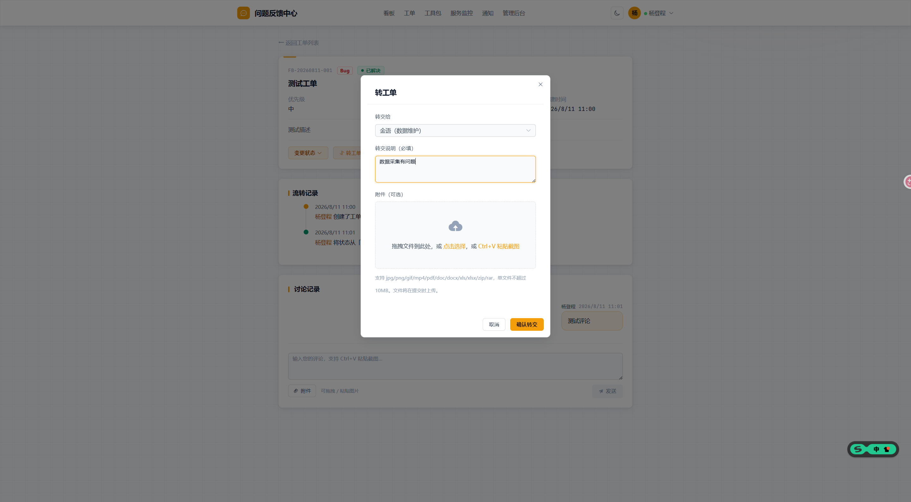

### 4. 工具包维护（系统开发 / 研发主管 / 管理员）

- **新建工具包**：工具包页「新建工具包」，填名称 / 省份 / 分类 / 简介 / 说明文档（Markdown，支持粘贴图片）。
- **发布新版本**：详情页「发布新版本」，填版本号、上传 `.js` 文件、写更新说明。
- **版本历史**：每个版本显示上传文件名（过长自动省略，鼠标悬停看全名）；维护者可删除版本，删除最新版本时自动回退到次新版本。
- **上架 / 下架**：控制客户是否可见。
- **字典**：工具包页「管理省份 / 分类」维护省份与分类。

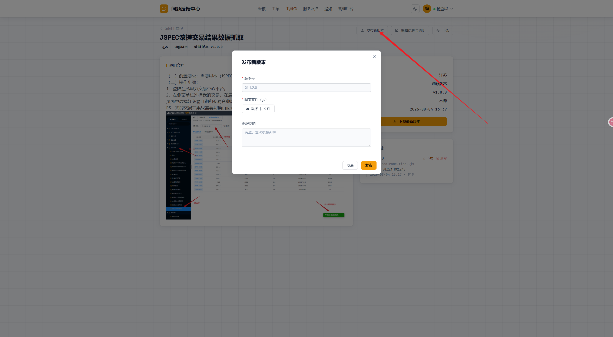

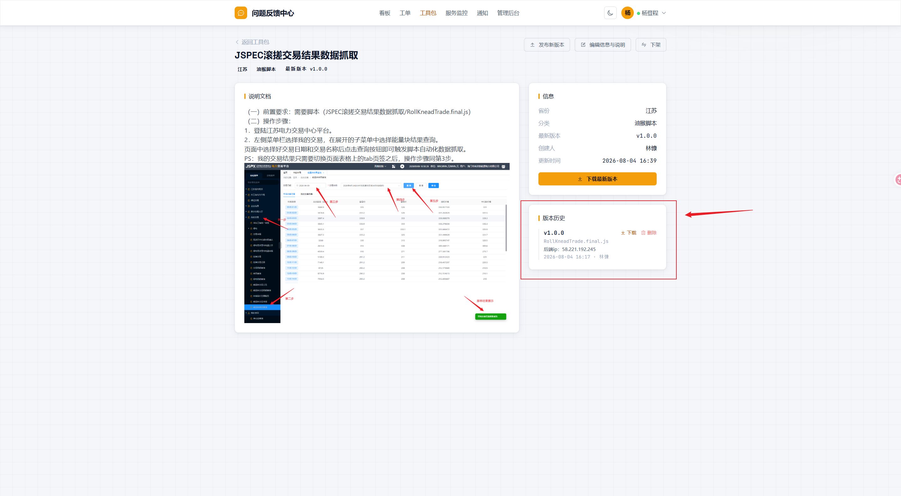

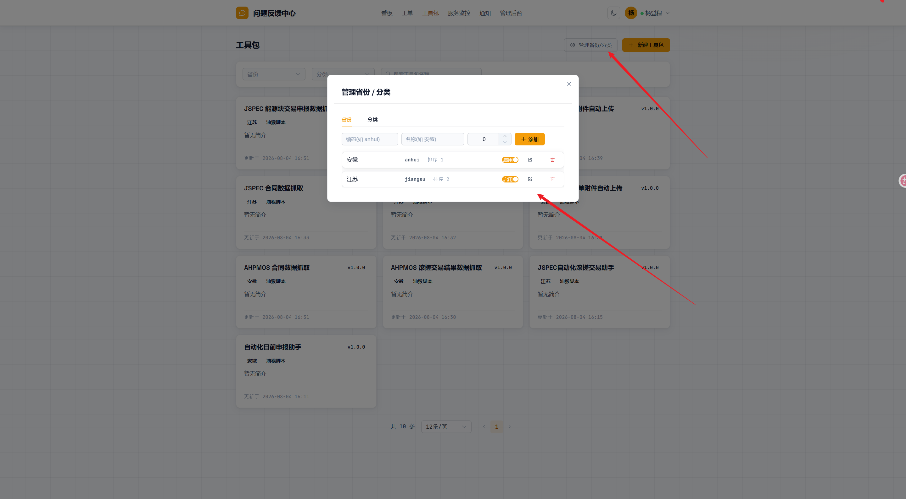

### 5. 服务监控

顶栏「服务监控」（仅研发相关角色可见），新标签页打开监控面板。

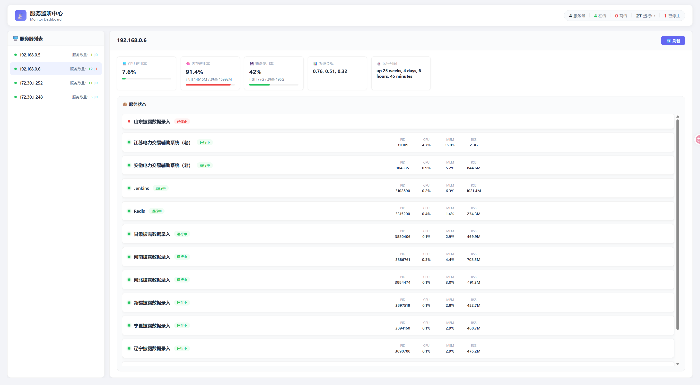

---

## 四、管理员使用（管理员 + 研发主管）

后台管理左侧菜单：**工单管理 / 用户管理**。

### 1. 用户管理

- 新建用户、编辑、启用 / 停用、变更角色。
- **删除用户**：单行「删除」或勾选后「批量删除」，其工单 / 评论 / 附件 / 通知一并清理，**不可恢复**。
- 保护规则：不能删除当前登录用户、不能删除最后一个管理员。

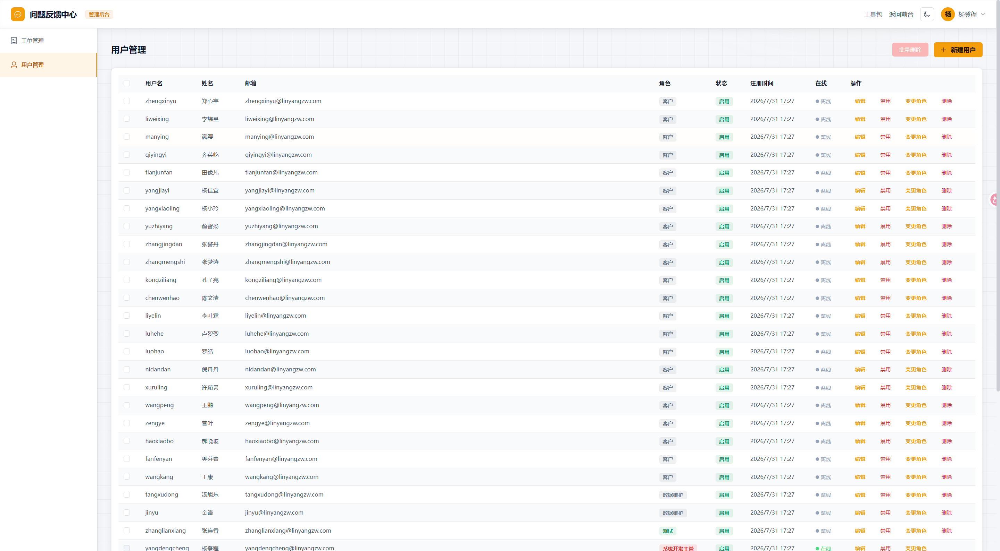

### 2. 工单管理

- 查看全平台工单，分配处理人、变更状态。
- 单行「删除」或勾选后「批量删除（N）」，级联清除评论 / 附件 / 通知 / 日志，**不可恢复**，谨慎操作。

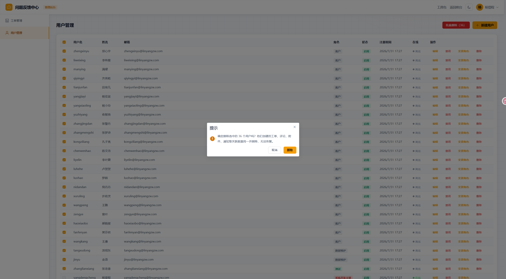

---

## 五、常见问题

1. **为什么看不到别人的工单？** 数据范围按角色划分（见通用第 4 节）。
2. **收不到桌面通知？** 先看浏览器通知权限是否「允许」；HTTP 环境按文末附录配置。站内铃铛通知不受影响。
3. **工单已解决但问题还在？** 客户点「未解决，继续讨论」退回，或已关闭后「重新打开」。
4. **转交为什么必须填说明？** 说明写入流转记录，便于追溯交接原因。
5. **忘记密码 / 账号被停用？** 联系管理员在后台处理。
6. **误删的工单 / 用户能恢复吗？** 不能，删除均不可恢复，操作前请确认。

---

## 附：HTTP 环境开启桌面通知（Chrome，一次性配置）

1. 地址栏打开 `chrome://flags/#unsafely-treat-insecure-origin-as-secure`；
2. 找到 **Insecure origins treated as secure**；

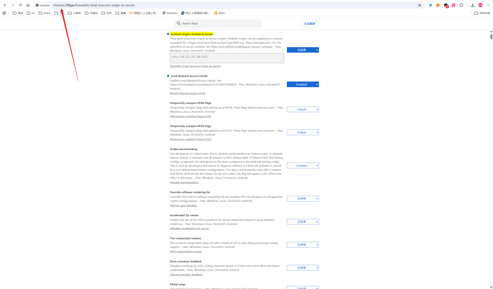

3. 填入完整来源（含协议、IP、端口），如 `http://58.221.192.245:3333`，多个用英文逗号分隔；
4. 设为 **Enabled**，点 **Relaunch** 重启浏览器；

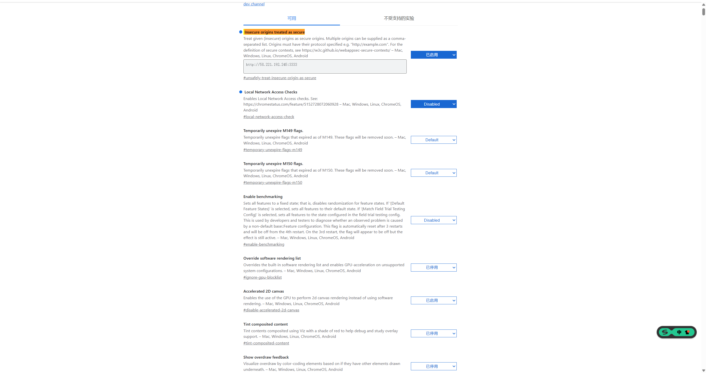

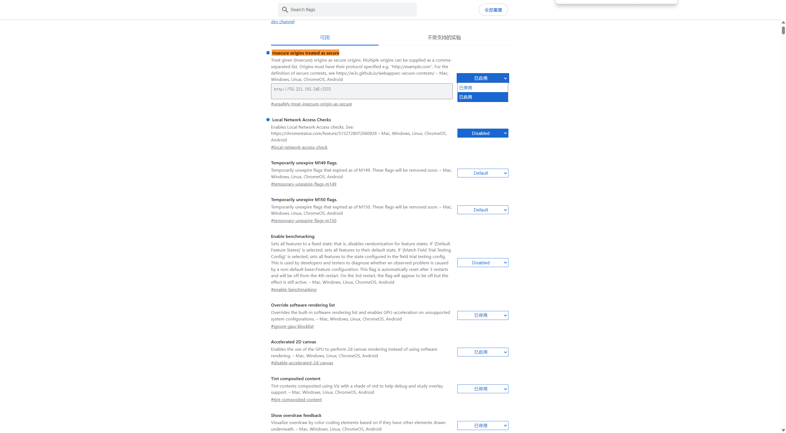

5. 重新打开平台 → 地址栏左侧图标 → 网站设置 → 通知 → 「允许」。

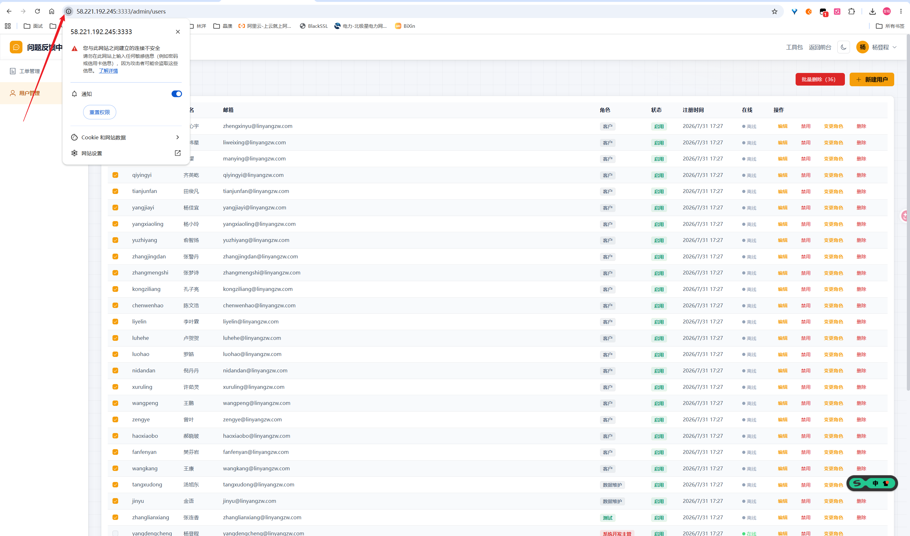

> 每台电脑各自设置一次即可；后续如部署 HTTPS 则无需此配置。
